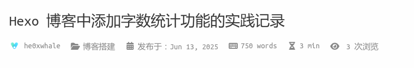

在搭建 Hexo 博客并使用 Volantis 主题时，我尝试为文章添加字数统计功能。以下是我在此过程中遇到的问题和最终解决方案的完整记录。

## 一、安装插件与初始配置

我按照_config.yml中说明的，安装了 `hexo-wordcount` 插件：
```bash
  npm i hexo-wordcount
```
并在博客volantis主题目录下的 `_config.yml` 文件中进行了如下配置：

```yml
plugin:
  # ...(省略)
  wordcount:
    enable: true
```


并运行以下命令以重建博客：

```bash
hexo clean && hexo g && hexo s
```

## 二、发现没有生效

尽管配置无误，且 `hexo-wordcount` 插件安装成功，但在本地启动博客预览时，文章标题下方并未显示任何字数统计信息。

## 三、逐步排查

### 1. 检查 `article.ejs`

首先我查看了主题路径下的 `themes/volantis/layout/_partial/article.ejs`，发现其通过 `<%- partial('meta', {post: post, position: 'top'}) %>` 引用了 `meta.ejs` 文件，即所有顶栏信息都来源于该处。

### 2. 查看 `meta.ejs`

继续跟踪到 `themes/volantis/layout/_partial/meta.ejs`，该文件通过如下逻辑决定顶部信息的内容：

```ejs
<% getList(topMetas).forEach(function(meta) { %>
  <% if (meta in theme.article.body.meta_library){ %>
    <%- partial('../_meta/' + meta, {post: post}) %>
  <% } %>
<% }) %>
```

说明真正负责渲染字数统计的代码位于 `themes/volantis/layout/_meta/wordcount.ejs` 文件。

### 3. 找到字数统计渲染模板

我找到了该文件，其内容如下：

```ejs
<% if (theme.plugins.wordcount.enable) { %>
  <div class="new-meta-item wordcount">
    <a class='notlink'>
      <i class="<%- theme.article.body.meta_library.wordcount.icon_wordcount %> fa-fw" aria-hidden="true"></i>
      <p><%- __('post.wordcount', wordcount(post.content))%></p>
    </a>
  </div>
  <div class="new-meta-item readtime">
    <a class='notlink'>
      <i class="<%- theme.article.body.meta_library.wordcount.icon_duration %> fa-fw" aria-hidden="true"></i>
      <p><%- __('post.duration', min2read(post.content))%></p>
    </a>
  </div>
<% } %>
```

模板存在，配置也没报错，为什么就是不显示呢？

## 四、真正的原因

查看和AI的对话，我注意到了top_meta这个配置项，最终我意识到问题出在一个不起眼的配置项：

```yml
theme:
  article:
    body:
      top_meta: [author, category, date, wordcount, counter]
```

在我的原始配置中，并未在 `top_meta` 中包含 `wordcount`，所以尽管一切准备就绪，模板中没有调用它，自然就不会渲染出来。

## 五、成功显示

添加了 `wordcount` 到 `top_meta` 列表后，再次运行：

```bash
hexo clean && hexo g && hexo s
```


最终，在文章标题下方正确显示了字数统计和阅读时长信息：


---

至此，字数统计功能成功集成。如果你也遇到类似问题，可以从以下几点排查：

- 插件是否正确安装
- `_config.yml` 中是否启用了 `wordcount`
- `top_meta` 中是否包含 `wordcount`
- 模板文件是否存在 `wordcount.ejs`

希望这篇文章能帮到你。
