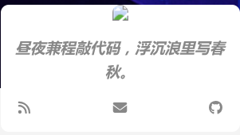
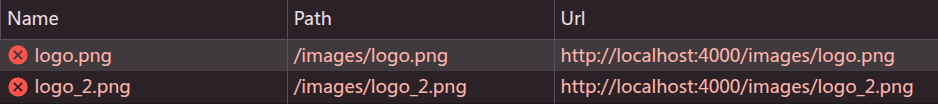

## 问题描述

在使用 Hexo 搭建博客（主题为 Volantis）过程中，用户修改了博客头像路径：

```yaml
avatar: /images/website/avatar.png
```

原头像为旧图 `/images/logo_2.png`，已确认删除。但在使用 `hexo server` 启动后，首页初始加载时头像显示正常，一旦**打开 Chrome DevTools 并刷新页面**，头像却重新变回 `/images/logo_2.png`，尽管图片已被删除，且请求返回 404。




---

## 排查过程

### ✅ 配置方面

- 清除 Hexo 缓存：`hexo clean && hexo g`
- 删除 `public/`、`.cache/`、`db.json`
- 确认 `themes/volantis/_config.yml` 中 `widgets.blogger.avatar` 设置正确
- 确认模板文件 `blogger.ejs` 中渲染了正确路径
- 使用固定路径 `` 确保非变量问题

### ✅ 运行时调试

- 使用 Firefox 正常，问题仅在 Chrome DevTools 下复现
- DevTools 开启前头像正确，开启后刷新页面出现问题
- 尝试了 Break on → Attribute modifications，无效
- 控制台无 JS 报错，无 fallback 行为日志
- `document.querySelector('.avatar img').src` 被动变为旧图
- 请求图片地址状态码为 404，但仍被请求

### ✅ 判断结果

此现象**并非 Hexo 模板或输出问题**，而是 Chrome DevTools 打开时触发了某种缓存/快照机制，例如：

- Memory Cache
- Back/Forward Cache（bfcache）
- 离线快照还原（某些版本 DevTools 有此行为）

这些机制会在刷新时“还原”旧 DOM 结构，或尝试访问旧图片路径，导致配置失效假象。

---

## 推荐的分析方法

1. `grep` 分析 Hexo 输出 HTML：确认没有旧图引用
2. `curl` 拉取页面源码，跳过浏览器行为确认 HTML 是否干净
3. 使用 Puppeteer 加载页面，分析 DOM 实际渲染头像路径
4. 使用 DevTools Performance 追踪是否有 JS 篡改 DOM
5. 使用 MutationObserver 实时监控 `img[src]` 是否被改写

```js
const avatarImg = document.querySelector('.avatar img');
const observer = new MutationObserver(mutations => {
  mutations.forEach(m => {
    if (m.attributeName === 'src') {
      console.warn('[MutationObserver] src changed to:', avatarImg.src);
      console.trace();
    }
  });
});
observer.observe(avatarImg, { attributes: true });
```

---

## 最终选择

由于问题可能来自浏览器的复杂缓存机制，短期内无法完全复现和修复，因此决定先不继续深究，保留此记录供未来参考。也欢迎大家留言共同讨论该问题

---

## 建议与避坑技巧

- 所有头像/图片路径建议添加查询参数：`?v=20250619` 避免缓存
- `hexo clean && rm -rf public/` 是每次改图后的标准操作
- DevTools 开启时务必勾选 `Disable cache`
- `widgets.index/page/mobile` 均应显式设置 `avatar`

