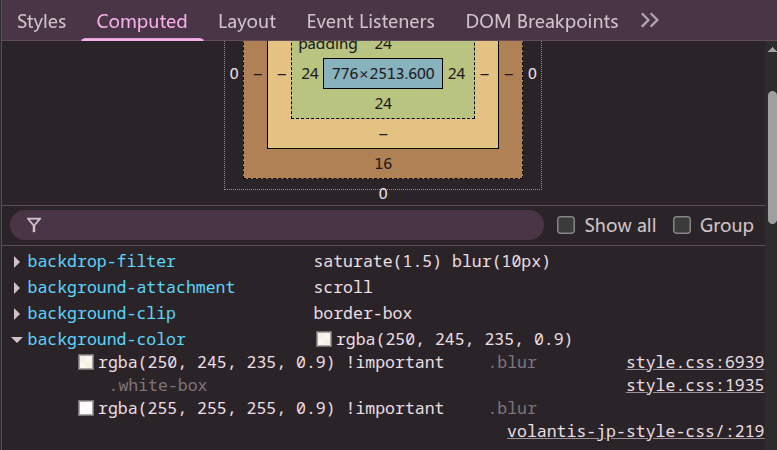

在搭建 Hexo 博客并使用 Volantis 主题的过程中，为了营造一种温柔、宁静、类似吉卜力风格的视觉效果，我进行了以下几个方面的样式调整和优化。

## 顶栏样式调整

将默认主题的顶栏背景色替换为柔和的奶油色：

```css
#l_header {
  background-color: #e5ddc5 !important;
  box-shadow: none !important;
}
```

## 链接颜色调整

为了呼应整体的暖色调，同时保持良好的可读性和视觉反馈，设置了如下链接颜色：

```css
a {
  color: #3b7d99;
}
a:hover {
  color: #bb4d3b;
}
```

## 模糊背景优化

Volantis 默认通过 `.blur` 类结合 `backdrop-filter` 添加半透明白色背景。为了贴近吉卜力风格，我将其调整为更温暖的色调：

```css
.blur {
  background: rgba(250, 245, 235, 0.9) !important;  /* 柔和奶油白 */
  backdrop-filter: saturate(150%) blur(10px);
}
```

这可以让导航栏、顶部 cover 区域呈现柔光玻璃质感，更加温润不刺眼。

## 全局背景色设置

为了让整个页面背景统一、温暖，采用柔和的奶油白作为主背景色，适用于页面主体、头部、底部等区域：

```css
body,
.page,
.header,
.footer,
.main {
  background-color: #fff8e7 !important; /* 奶油白 */
}
```

## 背景色覆盖说明：问题定位与排查过程

在设置 `body` 或 `article` 的背景色时，我遇到了一个问题：**即使使用了 `!important`，设置的背景色依然无效**，在 DevTools 中甚至会被划掉删除线。

 排查过程如下：

1. **初步怀疑被其他类覆盖**，尝试提升选择器优先级，如 `article.card`，仍然无效。
2. **观察 computed style** 面板，发现真正生效的背景来自一个透明白的 `rgba` 值。
    
3. 逐层审查 DOM，最终在 `.blur` 类上找到了这条规则：

   ```css
   .blur {
     background: rgba(255,255,255,0.9) !important;
   }
   ```

   这是 Volantis 主题为了实现玻璃拟态效果而添加的样式。

4. 确认该规则在支持 `backdrop-filter` 的浏览器中通过 `@supports` 被启用，并且优先级极高。
5. 尝试对 `.blur` 使用新的背景覆盖，测试不同透明度、颜色组合后，最终选用 `rgba(250, 245, 235, 0.9)` 作为主色。
6. 同时，为防止 `.blur` 遮盖全局背景，设置 `body`, `.page`, `.main` 等关键容器背景色统一为奶油白。

---

通过上述设置，一个风格统一、色彩柔和、具有吉卜力美感的博客界面就完成了。

如果你也想打造自己的特色博客风格，不妨从配色入手，加入些微动效与模糊处理，会让整体观感更加细腻舒适。
